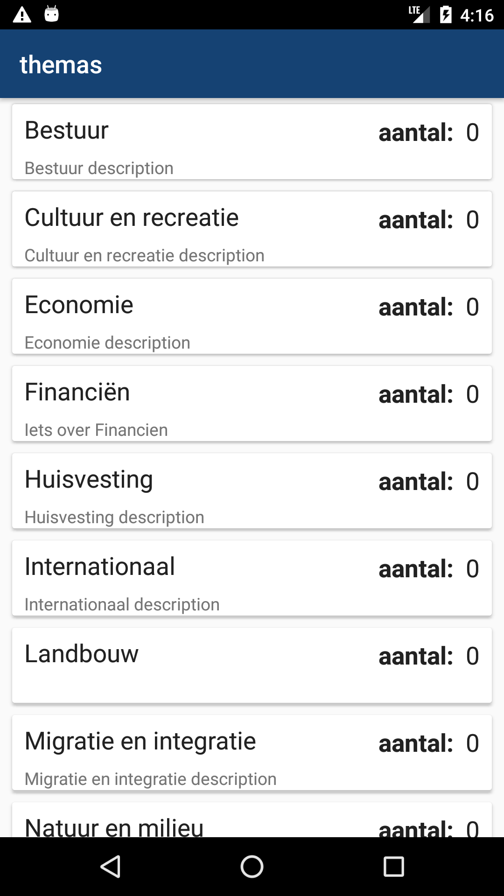
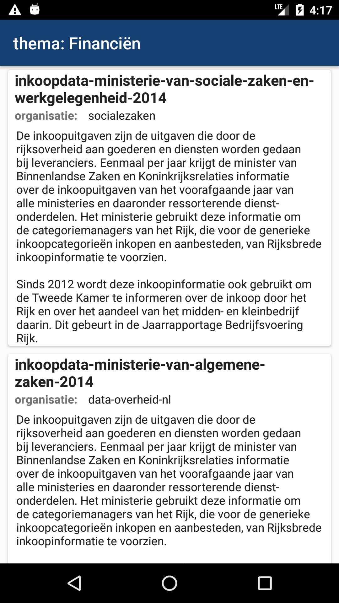

# Android Architecture Sample

[Android Architecture Components](https://developer.android.com/topic/libraries/architecture/index.html) were announced in Google I/O 2017.
This is just a sample app explaining the new Architecture Guidelines written in **Kotlin**. The project this one is based on can be found [here](https://github.com/abhinav272/NewsApp), which is also the base project, this project is forked from. That project itself is hugely  inspired by [Googles GitHubBrowserSample](https://github.com/googlesamples/android-architecture-components/tree/master/GithubBrowserSample), which showcases all the modern stuff, but is (still) written in java
 This project displays data from the Dutch government from https://data.overheid.nl/. The available datasets from the Dutch governement are grouped into themes. 

  

The first list the app displays is a list of [themes](https://github.com/dataoverheid/waardelijsten/blob/master/v2.0.0/donl-themes.json), which I modified a bit and put [here](https://hansvdam.github.io/overheidsthemes.json).
 Further documentation on the api of data.overheid (dutch for data.government) can be found [here](https://data.overheid.nl/technische-informatie), [here](https://data.overheid.nl/api) and [here](http://docs.ckan.org/en/latest/)

The list of themes in the app also shows how many datasets belong to the theme (0 at the moment as it is not implemented yet). The themes are  stored in a DB via Room. This means that after it's first use it is also
available offline AND is not fetched every time it is viewed. The ThemesRepository has a RateLimiter which determines after how much time the data in the database is stale and should be refetched.

When you  click on a theme, a list of datasets belonging to that theme is shown.

**The following text is from the original NewsApp project:** 

## Components Used
- [LiveData](https://developer.android.com/topic/libraries/architecture/livedata.html)
- [ViewModel](https://developer.android.com/topic/libraries/architecture/viewmodel.html)
- [Room Persistence Library](https://developer.android.com/topic/libraries/architecture/room.html)

## About App
This app uses 
It uses [Retrofit 2](http://square.github.io/retrofit/) to fetch news sources and news headlines from the API and displays in a RecyclerView.
It uses [Room Persistence Library](https://developer.android.com/topic/libraries/architecture/room.html) to provide offline functionality
App first loads the data from DB and then checks for fresh data from API, API is only called if DB data is empty or expired
The main aim of this sample app is show how to use the new [Architecture Guidelines](https://developer.android.com/topic/libraries/architecture/index.html) with Kotlin.

## Architecture

The app uses `ViewModel` to abstract the data from UI and `Repository` as single source of truth for data. `Repository` fetch the data from database and shows, while also checks if the data is old. If the data is old or database does not contain any data (such as first launch) it fetches data from Web Service and saves the data into database.

--------------------

  <h3>Proudly :muscle: made in <b><a href="https://kotlinlang.org/">Kotlin</a></b></h3>

## License
-------

    The MIT License (MIT)
    
    Copyright (c) 2017 Abhinav Sharma
    
    Permission is hereby granted, free of charge, to any person obtaining a copy
    of this software and associated documentation files (the "Software"), to deal
    in the Software without restriction, including without limitation the rights
    to use, copy, modify, merge, publish, distribute, sublicense, and/or sell
    copies of the Software, and to permit persons to whom the Software is
    furnished to do so, subject to the following conditions:

    The above copyright notice and this permission notice shall be included in all
    copies or substantial portions of the Software.

    THE SOFTWARE IS PROVIDED "AS IS", WITHOUT WARRANTY OF ANY KIND, EXPRESS OR
    IMPLIED, INCLUDING BUT NOT LIMITED TO THE WARRANTIES OF MERCHANTABILITY,
    FITNESS FOR A PARTICULAR PURPOSE AND NONINFRINGEMENT. IN NO EVENT SHALL THE
    AUTHORS OR COPYRIGHT HOLDERS BE LIABLE FOR ANY CLAIM, DAMAGES OR OTHER
    LIABILITY, WHETHER IN AN ACTION OF CONTRACT, TORT OR OTHERWISE, ARISING FROM,
    OUT OF OR IN CONNECTION WITH THE SOFTWARE OR THE USE OR OTHER DEALINGS IN THE
    SOFTWARE.
-------

    The MIT License (MIT)

    Copyright (c) 2018 Hans van Dam

    Permission is hereby granted, free of charge, to any person obtaining a copy
    of this software and associated documentation files (the "Software"), to deal
    in the Software without restriction, including without limitation the rights
    to use, copy, modify, merge, publish, distribute, sublicense, and/or sell
    copies of the Software, and to permit persons to whom the Software is
    furnished to do so, subject to the following conditions:

    The above copyright notice and this permission notice shall be included in all
    copies or substantial portions of the Software.

    THE SOFTWARE IS PROVIDED "AS IS", WITHOUT WARRANTY OF ANY KIND, EXPRESS OR
    IMPLIED, INCLUDING BUT NOT LIMITED TO THE WARRANTIES OF MERCHANTABILITY,
    FITNESS FOR A PARTICULAR PURPOSE AND NONINFRINGEMENT. IN NO EVENT SHALL THE
    AUTHORS OR COPYRIGHT HOLDERS BE LIABLE FOR ANY CLAIM, DAMAGES OR OTHER
    LIABILITY, WHETHER IN AN ACTION OF CONTRACT, TORT OR OTHERWISE, ARISING FROM,
    OUT OF OR IN CONNECTION WITH THE SOFTWARE OR THE USE OR OTHER DEALINGS IN THE
    SOFTWARE.
